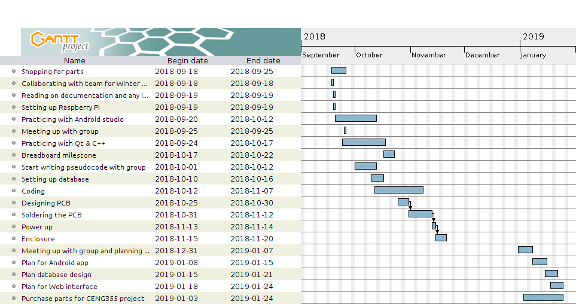

# MacroKeyTouchSensor

## Table of Contents
* [Parts](#parts)
* [Time Commitment](#time)
* [Connecting the MPR121 to Raspberry Pi with the breadboard](#breadboard_connect)
* [PCB & Soldering](#pcb_solder)
* [Assembly](#assembly)
* [Power Up](#powerup)
* [Unit Testing](#unit_testng)

## <a name="parts">Parts</a>
* Raspberry Pi + microSD card
* Copper tape
* A platform
    *  Can be cardboard, acrylic casing (like mine)
*  Wire strippers
*  Breadboard cables
*  Breadboard

Note: expect to pay roughly $150 in parts

## <a name="time">Time Commitment</a>
The hardware portion of the project can be done in about a week, if you follow the instructions directly & spent at least 2 hours per day on this project.  Maybe 3 weeks to 2 months if you make modificatons.  The Gantt chart below shows how much time I allocated assuming I work once to twice a week

##  Connecting the MPR121 breakout sensor to the Raspberry Pi with the breadboard

See [this part of the guide](#breakout_solder) for soldering the breakout board before testing.

### Testing on the breadboard
Connecting to the breadboard is crucial because we don't want our hard work to go to waste if the sensor turns out to be a paperweight.

1. Connect the following pins on the MPR121 breakout board to the Raspberry Pi
    *  MPR121 Vin - Pi 3.3V
    *  MPR121 GND - Pi GND
    *  MPR121 SCL - Pi SCL
    *  MPR121 SDA - Pi SDA

2. Make sure that the Pi can detect any I2C input.
    * `sudo raspi-config` on the terminal
    * Select "Interfacing"
    * Select "I2C" then select "yes" when it asks you if you want to enable it.
    
3. Test out if the sensor works with `sudo i2c-detect -y 1` on the Pi's terminal.

## <a name="pcb_solder">PCB & Soldering</a>

Soldering the MPR121 breakout requires 2 separate headers, 1 for each side.

### Printing the PCB
The gerber files required for the printing of the PCB are in `Schematics/MacroKeyTouchSensor_gerber`.  Modify the files if need be.

### <a name="breakout_solder">Soldering the pins to the breakout board</a>
Make sure that the side you're soldering is the short side.  In addition, make sure that no pins interfere with others.  This is one of the harder ones as there are a lot of them and they're tightly packed together.

### Soldering to the PCB
When you start soldering the PCB, make sure to solder one of the headers underneath the PCB for it to connect to the Raspberry Pi.  I suggest going for a shorter header because it can get **really** tight and hard to take off.  Also, it can be inbalanced.

The rest of the headers gets soldered at the top side of the PCB.

### Optional: Solder a wire and a breadboard wire
Cut a normal wire and a breadboard wire in half.  Make sure that the overall length is approximately 13cm.  Solder the 2 wires together. Afterwards, strip the other end for conection to the case.  Make 12 of these.

This is optional because a normal wire can be plugged in, but a breadboard wire is more secure.

 

*Hint: Best to go for less pins connected to the Pi itself because it can get really hard to take out if you're not careful.*

## <a name="assembly">Assembly</a>
A basic case with 12 pre-made holes for the sensor's 12 points are in the Schematics directory under the file name `MacroKeyTouchSensor_case.cdr`.  Make sure that the you have CorelDraw to make the case, but it can be converted to a standard `.svg` file.

1. Insert the stripped end of the wire to the holes on top of the case.  Cover it up with copper tape for wider touch target.
2. Once all 12 pins are secured on the case, connect the other end each of their respective pins.
3. Attach each side of the case to each other.

## <a name="powerup">Power up</a>
* Power up the Pi, and run `sudo i2cdetect -y 1`

## <a name="unit_testing">Unit Testing</a>
* The repo also comes with a Python 2 test code under the file name `cap-touch.py`.  Place the file on your the root of the home directory of your Pi (not in Documents, Downloads, etc.), and run the command `python cap-touch.py`.  Touch each of the nodes on your case to make sure it responds.

    

