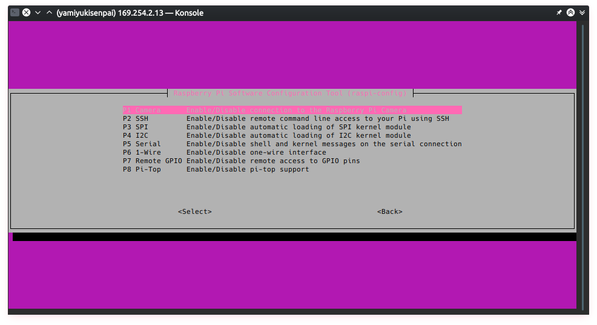
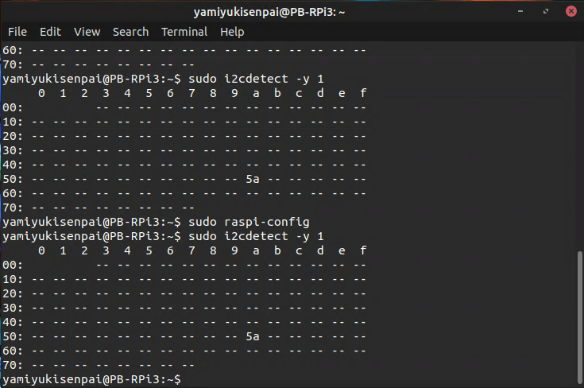
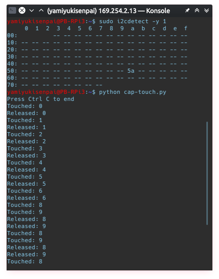

# MacroKeyTouchSensor

## Parts
* Raspberry Pi + microSD card
* Copper tape
* A platform
    *  Can be cardboard, acrylic casing (like mine)
*  Wire strippers
*  Breadboard cables

Note: expect to pay roughly $150 in parts

# Time Commitment
The hardware portion of the project can be done in about a week

## Connecting the MPR121 breakout sensor to the Raspberry Pi
* Connect the following pins on the MPR121 breakout board to the Raspberry Pi
    *  MPR121 Vin - Pi 3.3V
    *  MPR121 GND - Pi GND
    *  MPR121 SCL - Pi SCL
    *  MPR121 SDA - Pi SDA

* Make sure that the Pi can detect any I2C input.
    * `sudo raspi-config` on the terminal
    * Select "Interfacing"
    * Select "I2C" then select "yes" when it asks you if you want to enable it.
    

## PCB & Soldering

Soldering the MPR121 breakout requires 4 separate headers.  Any headers are fine as long as you solder:

* 2 headers for the pins in Raspberry Pi board
    * 3.3V, GND, SCL, SDA
* 2 headers the 12 pins on the breakout board
    * 0-11

### Printing the PCB
The gerber files required for the printing of the PCB are in `Schematics/MacroKeyTouchSensor_gerber`.  Modify the files if need be.

### Soldering the pins to the breakout board
Make sure that the side you're soldering is the short side.  In addition, make sure that no pins interfere with others.  This is one of the harder ones as there are a lot of them and they're tightly packed together.

### Soldering to the PCB
When you start soldering the PCB, make sure to solder one of the headers underneath the PCB for it to connect to the Raspberry Pi.  Everything else gets soldered at the top.

### Optional: Solder a wire and a breadboard wire
Cut a normal wire and a breadboard wire in half.  Make sure that the overall length is approximately 13cm.  Solder the 2 wires together. Afterwards, strip the other end for conection to the case.  Make 12 of these.

This is optional because a normal wire can be plugged in, but a breadboard wire is more secure.  

 

*Hint: Best to go for less pins connected to the Pi itself because it can get really hard to take out if you're not careful.*

## Assembly
A basic case with 12 pre-made holes for the sensor's 12 points are in the Schematics directory under the file name `MacroKeyTouchSensor_case.cdr`.  Make sure that the you have CorelDraw to make the case, but it can be converted to a standard `.svg` file.

1. Insert the stripped end of the wire to the holes on top of the case.  Cover it up with copper tape for wider touch target.
2. Once all 12 pins are secured on the case, connect the other end each of their respective pins.
3. Attach each side of the case to each other.

## Power up
* Power up the Pi, and run `sudo i2cdetect -y 1`

* The repo also comes with a Python 2 test code under the file name `cap-touch.py`.  Place the file on your Pi, and run the command `python cap-touch.py`.  Make sure this is placed in the home directory (not in Documents, Downloads, etc.).  Touch each of the nodes on your case to make sure it responds.
    

