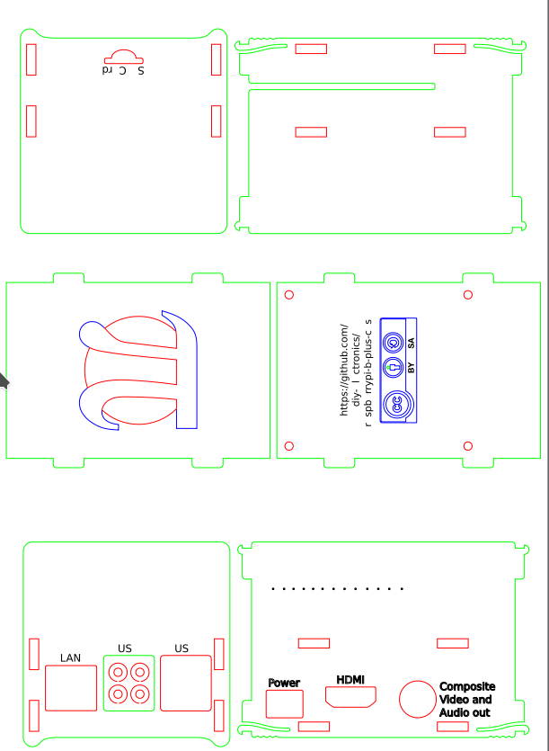
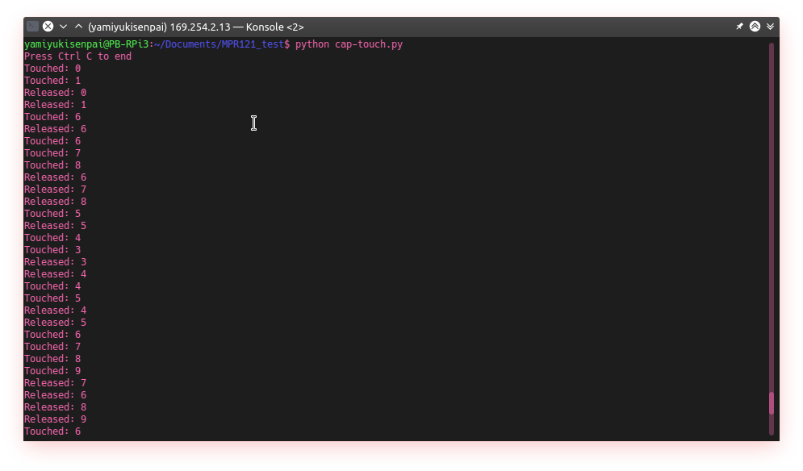
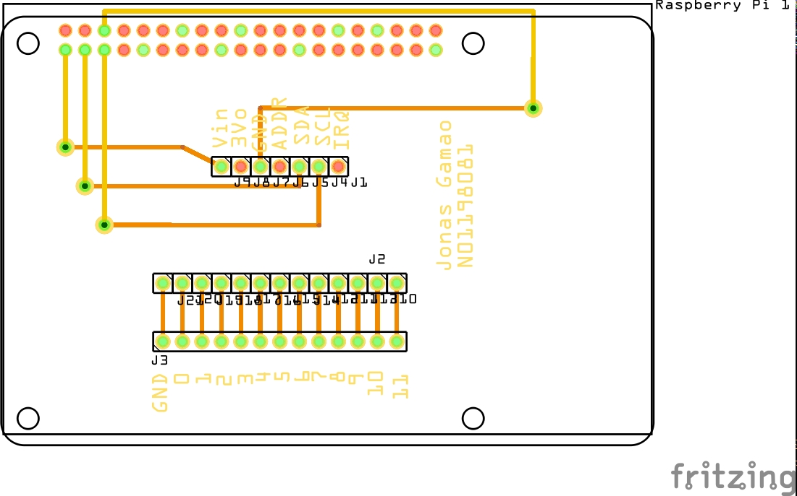
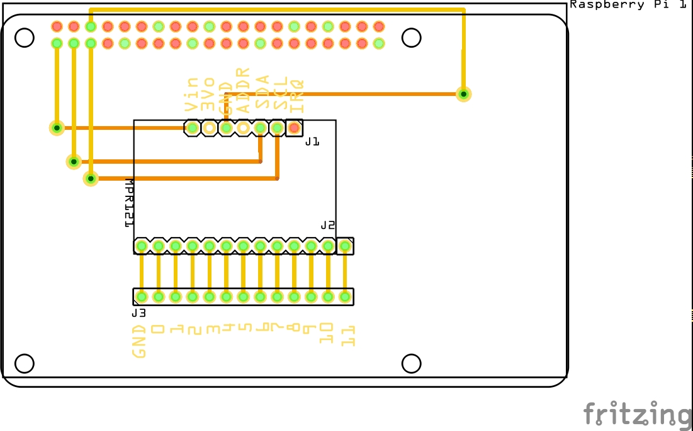

MacroKeyTouchSensor
===============

Week 12 Case design
------
### Activities vs Schedule
I am currently behind on the project.  I still need the case to be made.  I did finish the schematics today on CorelDRAW and sent it to the prototype lab.

### Problems
I had a smaller PCB made.  The headers got stuck on the Pi, and I had to resolder it becuase it removed some of the pins from the headers that are attached to the Pi.

Week 11 Testing the sensor
------------------------
### Actvities vs Schedule
I am currently on track with the project.  I had the project tested with a python code [I found on the internet](https://www.mbtechworks.com/projects/mpr121-capacitive-touch-for-raspberry-pi-project.html), which works.  The goal now is to make a case that will work with the PCB.

Week 10 Soldering Milestone
-----------------

### Actvities vs Schedule
I am currently behind schedule and cannot complete the soldering milestone today.  I did more research on code for it, [especially in C](https://github.com/sparkfun/MPR121_Capacitive_Touch_Breakout/blob/master/Firmware/MPR121Q/C%20code/main.c).

### Problem
The PCB's header hole are wider than it should've been.  I decided to delete the sensor and just manually create the headers for it.  The PCB is expected to be ready by tomorrow, November 7.

### Financial status
No other purchases necessary for this week.

###

Week 9 Fritzing and PCB
--------------

### Activities vs Schedule
I am currently slightly behind on the project due to the sensor not being correct on Fritzing's database

### Problem
The main problem is that Fritzing doesn't have the correect sensor in their database MPR121 does exist but it's missing 2 pins.  The one in their GitHub page is also outdated.

Week 8 Basic Breadboard assembly
---------------
### Activities vs the Schedule
As of right now, I'm on schedule with the project.  The component seems to be soldered correct and the Raspberry Pi 3 detected the device.

### Problems
The only problem I experienced today was that I made mistakes with the soldering, where I bridged some of my pins by accident.  This caused me to finish the soldering a lot longer than expected.  Last week, my MPR121 sensor had not arrived, and fell slightly behind with the soldering component.

### Financial Status
The first sensor was bought without paying for express shipping, but I did not expect the shipping dates to have a very wide margin.  Therefore, I ended up buying another sensor and paid for express shipping for it.  It ended up being a waste of money because both of them arrived on Friday, October 19.

Week 5 Proof of purchase
-------------
### Items delivered before this week

### Items pending delivery

Week 4
---------------

Created [budget document](Documentation/JonasGamao_N01198081_budget.xlsx)

Week 3
----------------

Created [Gantt chart](Documentation/Gantt.gan)

Week 2
---------------

Created [Proposal Content](Documentation/ProposalContentJonasGamao.xlsx)

Created the GitHub repository