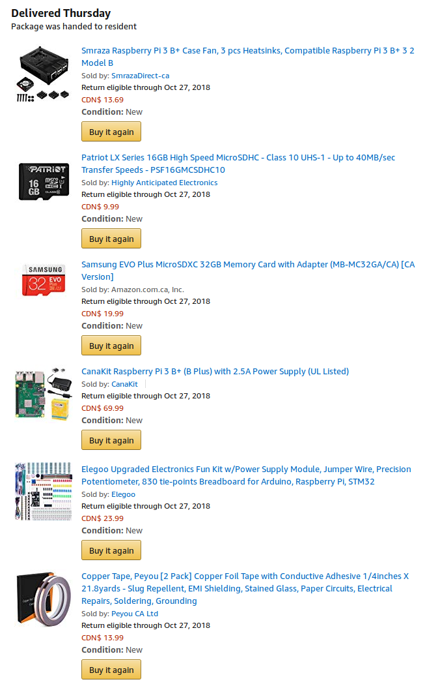
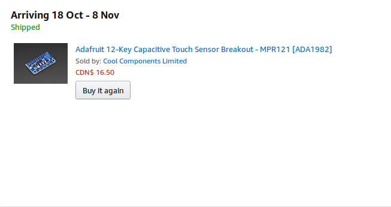

MacroKeyTouchSensor
===============

Week 8 Basic Breadboard assembly
---------------
### Activities vs the Schedule
As of right now, I'm on schedule with the project.  The only problem I experienced today was that I made mistakes with the soldering, where I bridged some of my pins by accident.  This caused me to finish the soldering a lot longer than expected.  Last week, my MPR121 sensor had not arrived, and fell slightly behind with the soldering component.

### Financial Status
The first sensor was bought without paying for express shipping, but I did not expect the shipping dates to have a very wide margin.  Therefore, I ended up buying another sensor and paid for express shipping for it.  It ended up being a waste of money because both of them arrived on Friday, October 19.

Week 5 Proof of purchase
-------------
### Items delivered before this week

### Items pending delivery

Week 4
---------------

Created [budget document](Documentation/JonasGamao_N01198081_budget.xlsx)

Week 3
----------------

Created [Gantt chart](Documentation/Gantt.gan)

Week 2
---------------

Created [Proposal Content](Documentation/ProposalContentJonasGamao.xlsx)

Created the GitHub repository